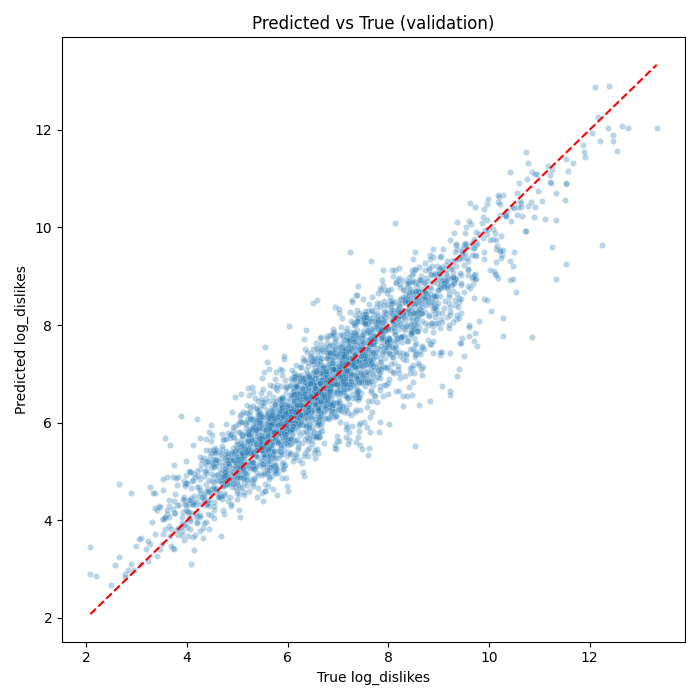
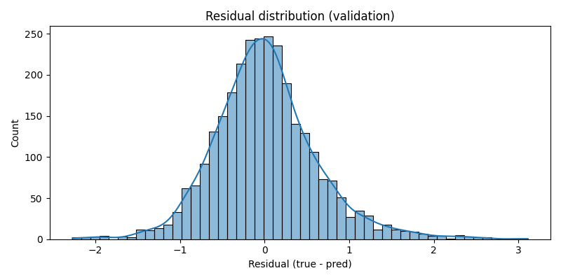
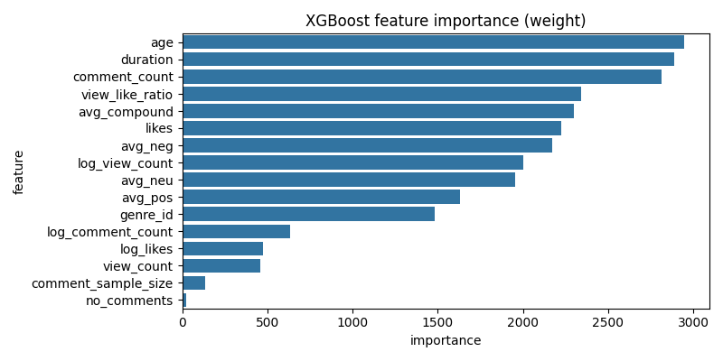
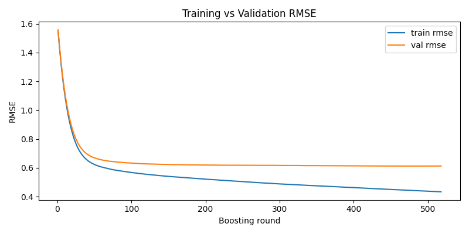

# XGBoost model selection report

This report documents a model selection run using XGBoost to predict `log_dislikes` from the available features in `yt_dataset_v5.csv`.

## Data
- Original dataset shape (after dropna): (29071, 18)
- Features used (16): ['age', 'avg_compound', 'avg_neg', 'avg_neu', 'avg_pos', 'comment_count', 'comment_sample_size', 'likes', 'log_comment_count', 'log_likes', 'log_view_count', 'no_comments', 'view_count', 'view_like_ratio', 'duration', 'genre_id']
- Train / Val / Test shapes: (21802, 16) / (2908, 16) / (4361, 16)

## Model & training
- Model: XGBoost XGBRegressor
- Best iteration (early stopping): 467

## Validation performance (used for model selection)
- RMSE: 0.6127
- MAE: 0.4562
- R^2: 0.8569

## Visualizations
Predicted vs True (validation):

Residual distribution (validation):

Feature importance:

Learning curve (RMSE per boosting round):

## Notes and insights
- The model was evaluated on the validation set (10% of data); the test set (15%) is held out and not used for selection as requested.
- Feature importance indicates which numeric features the tree-based model relies on most; consider domain-informed feature engineering for further improvement.
- Residual distribution and scatterplot show how predictions deviate; consider log-transforming other skewed inputs or adding interaction features.

## Artifacts
- Saved model: D:\Coding\Machine learning\YT dislikes\analysis\xgb_model_selection_joblib.pkl
- Plots directory: D:\Coding\Machine learning\YT dislikes\analysis\plots